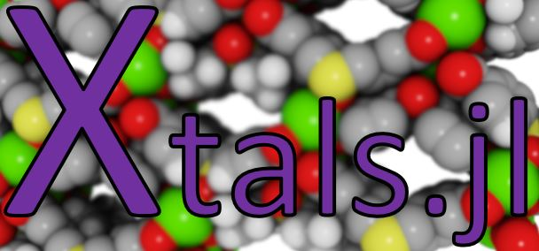

| **Documentation** | **Build Status** | **Test Coverage** |
|:---:|:---:|:---:|
|   |  |   |

A pure-[Julia](https://julialang.org/) package for importing, manipulating, and working with crystal structures, such as metal-organic frameworks (MOFs).
