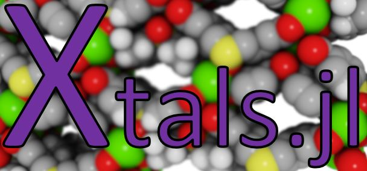

A pure-[Julia](https://julialang.org/) package for representation of porous
crystals such as metal-organic frameworks (MOFs).

*In development, please contribute, post issues 🐛, and improve!*

## Installation

1. Download and install the [Julia programming language](https://julialang.org/),
 v1.5 or higher.

2. In Julia, open the package manager (using `]`) and enter the following:

```
pkg> add Xtals
```

3. In Julia, load all functions in `Xtals.jl` into the namespace:

```
julia> using Xtals # that's it
```

## Tests
Run the tests in the script `tests/runtests.jl` manually or by `] test Xtals` in
the Julia REPL.
